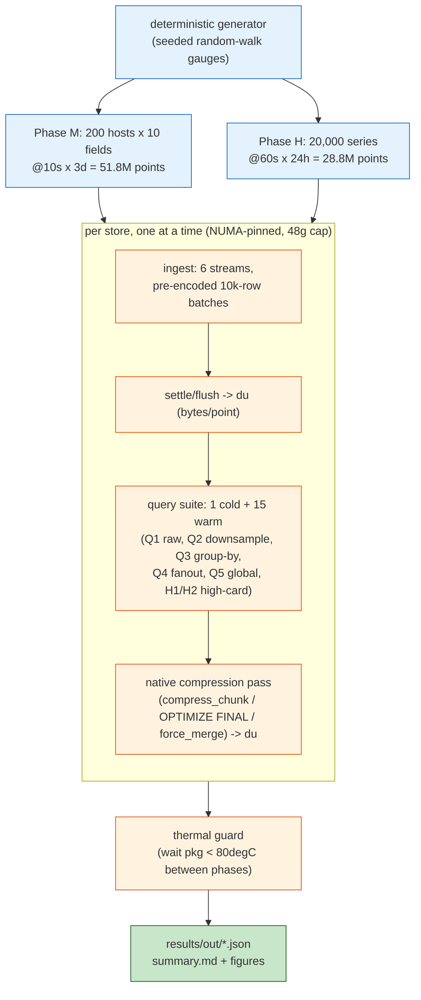
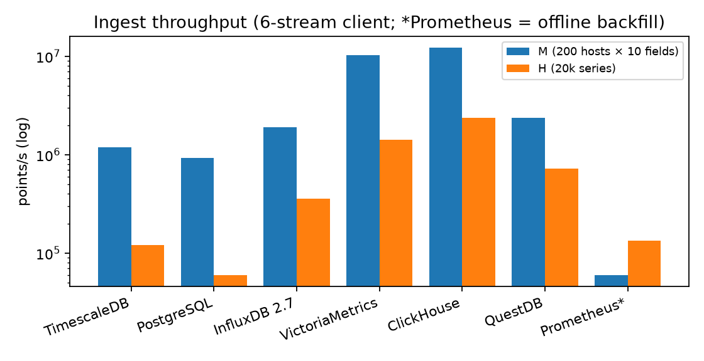
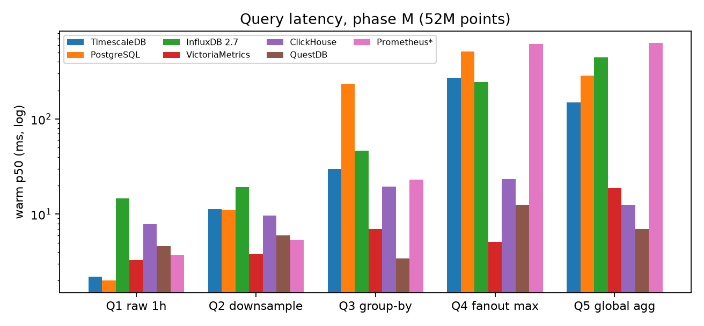

# tsdb-bench

[](LICENSE)
[](bench/bench.py)
[](results/summary.md)

**A one-node, out-of-box benchmark of seven time-series stores on identical
hardware, identical payload bytes, and untuned configs** — built to answer one
question honestly: *is TimescaleDB/PostgreSQL the best time-series database?*
The answer (measured, not argued): **Timescale is the better Postgres, not the
best TSDB** — it beats vanilla PG on every axis it advertises, and trails the
purpose-built engines on every axis they advertise.

```bash
# on the target machine (Docker + sudo):
bash atlas/setup_dbs.sh          # create the 7 pinned containers
bash atlas/run_bench.sh smoke    # ~5 min end-to-end validation of all adapters
bash atlas/run_bench.sh full     # the real campaign (~40 min measured work)
```

- **Ingest:** ClickHouse **12.2 M points/s** and VictoriaMetrics 10.2 M pts/s
  absorb the 52 M-point metrics phase in ~5 s; TimescaleDB takes 43 s, vanilla
  PostgreSQL 56 s — and that's COPY, Postgres's fastest path.
- **Disk:** VictoriaMetrics stores the same 52 M points in **0.63 bytes/point**
  (33 MB) — 40× smaller than Timescale's compressed hypertable (25 B/pt) and
  65× smaller than raw Postgres heap + btree (41 B/pt).
- **High cardinality is the great differentiator:** aggregating across 20,000
  series takes ClickHouse **59 ms**, QuestDB 85 ms, VictoriaMetrics 110 ms —
  TimescaleDB 1.2 s, PostgreSQL 2.5 s, and **InfluxDB 2.x 6.1 s** (the
  folklore cardinality collapse, reproduced on demand).
- **Selective lookups are a tie:** with a (host, time) btree, plain Postgres
  answers point/recent-range reads in 2 ms — as fast as anything measured.
  The engines only separate on scans, cardinality, and footprint.
- **Prometheus's embedded TSDB** is included via its sanctioned offline path
  (`promtool tsdb create-blocks-from openmetrics`): good storage (3.6 B/pt),
  fast selective PromQL, but it is a scrape-based monitoring system, not a
  writable database — that product, effectively, is VictoriaMetrics.

> The full write-up — per-store notes, decision rule by use case, and threats
> to validity — is the paper:
> **[`articles/2026-07-30-time-series-db-benchmark.md`](articles/2026-07-30-time-series-db-benchmark.md)**.
> Every number in it traces to a committed JSON in
> [`results/out/`](results/out/) produced by the pre-registered protocol in
> [`PROTOCOL.md`](PROTOCOL.md).

## Systems under test

| Store | Version | Write path | Query path |
|---|---|---|---|
| TimescaleDB | latest-pg16 (2.x) | COPY, 6 conns | SQL |
| PostgreSQL | 16 | COPY, 6 conns | SQL |
| InfluxDB | 2.7 OSS | line protocol HTTP | Flux |
| VictoriaMetrics | v1.102.1 | line protocol HTTP | PromQL |
| ClickHouse | 24.8 | CSV INSERT HTTP | SQL |
| QuestDB | 8.1.1 | ILP HTTP | SQL (+SAMPLE BY) |
| Prometheus | v2.53.0 | **offline** promtool backfill | PromQL |

## What the campaign runs



Fairness rules (full list in [`PROTOCOL.md`](PROTOCOL.md)): identical
pre-encoded bytes per format family, generation excluded from timing, one DB
at a time, out-of-box configs with only idiomatic schema setup (hypertable +
compression for Timescale, MergeTree ORDER BY for ClickHouse, SYMBOL +
PARTITION BY DAY for QuestDB), and cross-store row/series-count validation
after every query.

## Headline results




| | Ingest M (pts/s) | Disk M (B/pt) | Q4 fanout (ms) | H2 20k-series (ms) |
|---|---|---|---|---|
| ClickHouse | **12,197,647** | 8.3 | 23.4 | **58.8** |
| VictoriaMetrics | 10,224,852 | **0.63** | **5.1** | 109.6 |
| QuestDB | 2,382,352 | 20.4 | 12.6 | 84.5 |
| InfluxDB 2.7 | 1,891,280 | 4.1 | 244.8 | 6,141.3 |
| TimescaleDB | 1,196,123 | 25.1¹ | 270.1 | 1,203.6 |
| PostgreSQL | 933,549 | 40.5 | 510.8 | 2,527.5 |
| Prometheus² | 59,806² | 3.6 | 614.9 | 3,597.8 |

¹after `compress_chunk` on all chunks. ²offline `promtool` backfill — not
comparable to online ingest; queries and disk are.

Complete tables (all seven queries, warm p50/p95 + cold, both phases):
[`results/summary.md`](results/summary.md).

## Choose your path

| Goal | Start here |
|---|---|
| Read the conclusions and decision rule | [the paper](articles/2026-07-30-time-series-db-benchmark.md) |
| Check the method before trusting a number | [`PROTOCOL.md`](PROTOCOL.md) |
| Inspect raw measurements | [`results/out/*.json`](results/out/) (per-store), [`results/summary.md`](results/summary.md) |
| Rerun the whole campaign | [`atlas/setup_dbs.sh`](atlas/setup_dbs.sh) → [`atlas/run_bench.sh`](atlas/run_bench.sh) |
| Add an eighth database | subclass `Adapter` in [`bench/bench.py`](bench/bench.py) (7 worked examples) |
| Regenerate tables/figures | [`bench/analyze.py`](bench/analyze.py) |

## Layout

- `PROTOCOL.md` — pre-registered design: workload, fairness rules, query
  semantics mapping (SQL ↔ Flux ↔ PromQL), stated limitations.
- `atlas/setup_dbs.sh` — creates the 7 Docker containers (NUMA-pinned, 48 GB
  cap, bind-mounted data dirs, production services untouched).
- `atlas/run_bench.sh` — venv bootstrap + pinned harness launcher.
- `bench/bench.py` — generator, 7 adapters, ingest/query/disk phases,
  thermal guard, per-DB failure containment.
- `bench/analyze.py` — JSONs → `results/summary.md` + figures.
- `results/` — raw outputs of the 2026-07-30 run + aggregates.
- `articles/` — the paper and its figures.

## Caveats (read before quoting numbers)

Single node; RAID5 HDD storage; out-of-box configs (every store has real
tuning headroom); synthetic random-walk gauges — favorable to Gorilla-style
codecs, no strings/nulls/irregular timestamps; PromQL/Flux range queries
return step-resolution samples, so raw-read latencies are semantic
approximations for VM/Prometheus/Influx; no mixed ingest+query load; no
clustering, replication, or retention behavior. Full threats-to-validity
section in the paper. These bound the claims — they don't reverse a 40×
disk gap or a 100× cardinality spread.

## Hardware

HP Z840, 2× Xeon E5-2690 v3; benchmark pinned to one socket (12 cores + HT),
48 GB memory cap per store; data on a RAID5 HDD array; Docker 29; one store
running at a time with a thermal guard between phases.

## Citation

```bibtex
@misc{bond2026tsdbbench,
  author = {Bond, Andrew H.},
  title  = {tsdb-bench: a one-node, out-of-box benchmark of seven
            time-series stores},
  year   = {2026},
  url    = {https://github.com/ahb-sjsu/tsdb-bench}
}
```

MIT — see [LICENSE](LICENSE).

## License

Two licenses, split by what the file is.

| What | License | File |
|---|---|---|
| Prose and figures: documentation, articles, papers, notes, figures, data, README | [CC BY 4.0](https://creativecommons.org/licenses/by/4.0/) | `LICENSE-TEXT` |
| Source code: the package, scripts, tools, experiment harnesses, the code in notebooks | [MIT](https://opensource.org/licenses/MIT) | `LICENSE` |
