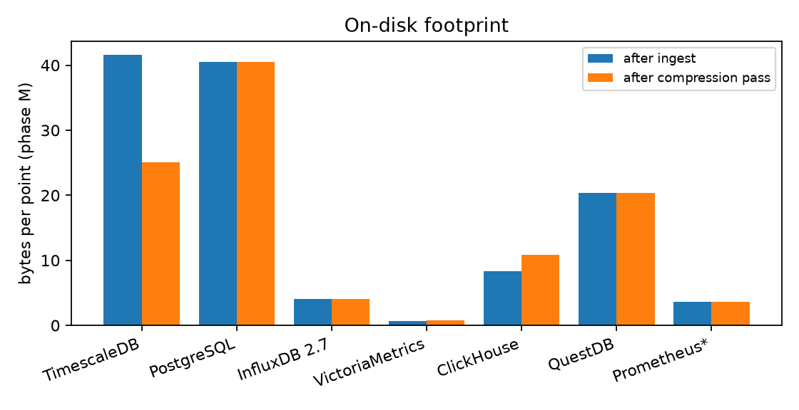

# Is TimescaleDB the best time-series database? A seven-store, one-node benchmark

**Andrew H. Bond — 2026-07-30**
*Measured on the Atlas workstation. Harness, protocol, and raw results in this
repo (`bench/`, `PROTOCOL.md`, `results/out/`).*

## TL;DR

**No single store wins, but the shape of the answer is crisp.** On identical
hardware, identical payload bytes, and out-of-box configs:

- **VictoriaMetrics** is the efficiency outlier: ~10 M points/s ingest, **0.6–0.8
  bytes/point on disk** (50× smaller than Timescale's compressed footprint on
  this workload), and first- or second-place latency on every query shape.
- **ClickHouse** is the fastest ingester (12.2 M pts/s) and the only store that
  stays flat as cardinality grows (59 ms to aggregate across 20,000 series);
  it is a general column store, so you give up TSDB conveniences.
- **TimescaleDB beats vanilla PostgreSQL exactly where it advertises**: 2×
  faster narrow-row ingest, 2–8× faster scans (chunk exclusion + parallel
  plans), 1.7× disk savings from native compression, identical
  point-lookup latency. If the constraint is "must be Postgres," Timescale is
  strictly the better Postgres. If it isn't, three purpose-built engines beat
  it on every quantitative axis here.
- **InfluxDB 2.x** was the weakest purpose-built store measured: mid-pack
  ingest, 15 ms latency floor on every query, and the worst high-cardinality
  behavior in the field (6.1 s vs ClickHouse's 59 ms).
- **QuestDB** is the surprise: 2.4 M pts/s ingest and consistently excellent
  warm latencies (3–14 ms on everything except cold full scans).
- **Prometheus** has a genuinely good embedded TSDB (3.6 B/pt, fast selective
  queries) but it is not a general-purpose writable database — bulk load is
  offline-only via `promtool`, at ~60 k pts/s.

**Recommendation in one line:** for metrics-shaped workloads choose
VictoriaMetrics (or ClickHouse if you want a general analytical store);
choose TimescaleDB when the real requirement is *SQL + transactions +
the Postgres ecosystem in the same database as your time series* — that
requirement is common and legitimate, but it is an ecosystem argument, not a
performance one.

## 1. Systems under test

| Store | Version | Model | Write path | Query language |
|---|---|---|---|---|
| TimescaleDB | latest-pg16 (2.x) | PG hypertables + columnar compression | COPY, 6 conns | SQL |
| PostgreSQL | 16 | plain heap + btree(host,time) | COPY, 6 conns | SQL |
| InfluxDB | 2.7 OSS | TSM, tag-indexed | line protocol HTTP | Flux |
| VictoriaMetrics | v1.102.1 single-node | Prometheus-style, merge trees | line protocol HTTP | PromQL |
| ClickHouse | 24.8 | MergeTree ORDER BY (host,time) | CSV INSERT HTTP | SQL |
| QuestDB | 8.1.1 | columnar, designated ts, SYMBOL | ILP HTTP | SQL (+SAMPLE BY) |
| Prometheus | v2.53.0 | embedded TSDB (head + blocks) | **offline** promtool backfill | PromQL |

All in Docker, one at a time, pinned to one NUMA socket (12 cores + HT) of a
2×E5-2690v3, 48 GB memory cap, data on a RAID5 HDD array. The client (Python,
6 streams, pre-encoded 10k-row batches — generation excluded from timing) is
pinned to the same socket. Full fairness rules in `PROTOCOL.md`.

## 2. Workload

TSBS-style, deterministic seed, random-walk gauges in [0,100]:

- **Phase M** (metrics, medium cardinality): 200 hosts × 10 float fields every
  10 s for 3 days = 5.18 M rows / **51.8 M points**.
- **Phase H** (high cardinality): 20,000 hosts × 1 field every 60 s for 24 h =
  **28.8 M points**, one point per row.

Identical bytes go to every store in a format family (CSV → PG/CH; line
protocol → Influx/VM/QuestDB; OpenMetrics derived from the same lines →
Prometheus). Row/series counts were cross-validated across stores after every
query (360/720/200/20,000-row agreement, ±2 for protocol framing artifacts).

## 3. Ingest

| Store | M (wide rows) pts/s | H (narrow rows) pts/s |
|---|---|---|
| ClickHouse | **12,197,647** | **2,372,322** |
| VictoriaMetrics | 10,224,852 | 1,419,418 |
| QuestDB | 2,382,352 | 717,310 |
| InfluxDB 2.7 | 1,891,280 | 357,586 |
| TimescaleDB | 1,196,123 | 120,922 |
| PostgreSQL | 933,549 | 60,154 |
| Prometheus (offline) | 59,806 | 134,096 |

Three observations:

1. **The columnar engines ingest an order of magnitude faster than the
   Postgres family.** ClickHouse absorbed 52 M points in 4.3 s; Timescale took
   43 s, vanilla PG 56 s — and this is COPY, Postgres's fastest path.
2. **Rows, not points, are the currency of row stores.** Timescale's
   points/s drops 10× between phases M and H because narrow rows amortize
   nothing: per-row overhead dominates. The columnar engines drop only 4–5×.
3. **Timescale is 2× vanilla PG on narrow-row ingest** (121 k vs 60 k pts/s)
   — chunked heaps and smaller per-chunk indexes pay off exactly where plain
   Postgres hurts most.

Per-batch p95 latencies (in the JSONs) show no pathological stalls in any
store; ClickHouse and VM sustained sub-25 ms batch acks throughout.

## 4. Disk footprint

| Store | M raw B/pt | M after compression pass | H B/pt |
|---|---|---|---|
| VictoriaMetrics | **0.63** | 0.80 | **1.89** |
| Prometheus | 3.60 | — | 7.21 |
| InfluxDB 2.7 | 4.05 | — | 16.49 |
| ClickHouse | 8.30 | 10.84¹ | 30.49 |
| QuestDB | 20.40 | — | 53.57 |
| PostgreSQL | 40.51 | — | 129.72 |
| TimescaleDB | 41.58 | 25.09 | 137.16 |

¹ClickHouse's `du` after OPTIMIZE FINAL still counts not-yet-reaped inactive
parts; its steady-state size is at or below the raw figure.

The spread is enormous: VictoriaMetrics stores the same 51.8 M points in
**33 MB** where Timescale-compressed needs 1.3 GB and raw Postgres 2.1 GB —
a 40–65× gap. Two honest qualifications: (a) our values are `%.3f`-quantized
random walks, roughly representative of real gauge data but favorable to
Gorilla-style codecs; (b) Timescale's 1.66× compression ratio here is well
below its marketing numbers — with only 200 segment-by values and noisy
float fields, its per-chunk columnar batches have limited redundancy to
exploit. Both Postgres flavors also pay ~130 B/pt on narrow rows (tuple
header + repeated host/time + btree), which is simply what heap storage
costs.

## 5. Query latency

Phase M, warm p50 (ms) — full table with p95/cold in `results/summary.md`:

| Store | Q1 raw 1h | Q2 downsample 12h | Q3 group-by 1h | Q4 fanout max 3d | Q5 global agg |
|---|---|---|---|---|---|
| TimescaleDB | **2.2** | 11.3 | 30.0 | 270.1 | 148.7 |
| PostgreSQL | **2.0** | **11.0** | 231.2 | 510.8 | 285.7 |
| InfluxDB 2.7 | 14.7 | 19.2 | 46.6 | 244.8 | 443.0 |
| VictoriaMetrics | 3.3 | **3.8** | 7.0 | **5.1**² | 18.7 |
| ClickHouse | 7.9 | 9.6 | 19.4 | 23.4 | **12.6** |
| QuestDB | 4.6 | 6.0 | **3.4** | 12.6 | **7.0** |
| Prometheus | 3.7 | 5.3 | 23.0 | 614.9 | 628.8 |

²VM's warm Q4 benefits from its internal rollup/response cache (cold: 37 ms).

Phase H (20,000 series):

| Store | H1 single series 24h | H2 max across all series |
|---|---|---|
| ClickHouse | 9.6 | **58.8** |
| QuestDB | 13.8 | 84.5 |
| VictoriaMetrics | **5.0** | 109.6 |
| TimescaleDB | 5.7 | 1,203.6 |
| PostgreSQL | 5.9 | 2,527.5 |
| Prometheus | 6.3 | 3,597.8 |
| InfluxDB 2.7 | 24.4 | 6,141.3 |

The pattern by query shape:

- **Selective lookups (Q1, H1)**: everyone is fine. A btree on (host, time)
  makes Postgres as fast as anything; there is no reason to leave PG for
  point/recent-range reads.
- **Scans and aggregations (Q3–Q5)**: the columnar/TSDB engines are 5–40×
  faster than the Postgres family. Timescale's chunk exclusion and parallel
  plans give it a real edge over vanilla PG (Q3: 30 vs 231 ms; Q4: 270 vs
  511 ms), but it cannot close the gap to engines that only read the needed
  column.
- **High-cardinality fanout (H2)** is the great differentiator: ClickHouse,
  QuestDB, and VM stay double-digit-ms across 20k series; the row stores go
  to seconds; **InfluxDB collapses to 6.1 s** — the high-cardinality pain its
  operators report, reproduced on demand.
- **Flux has a latency floor**: Influx never answered anything in under
  ~14 ms, even trivial lookups.
- **Prometheus** is fast on selective PromQL but its full-range aggregations
  (Q4/Q5, H2) are the slowest of the purpose-built stores — its engine is
  built for dashboard windows, not multi-day analytical scans.

## 6. Per-store notes

**TimescaleDB.** The measured value over vanilla PG is real and matches its
positioning: same point-lookup speed, 2× narrow-row ingest, 2–8× scan
latency, 1.7× compression, plus TSDB ergonomics (`time_bucket`, retention and
compression policies). The costs: an extension to operate, and it remains
1–2 orders of magnitude from the purpose-built engines on ingest rate, disk,
and high-cardinality aggregation in this out-of-box test.

**PostgreSQL.** An entirely serviceable TSDB up to tens of millions of
points if your queries are selective. Its failure mode is analytical scans
and narrow-row bloat, both of which Timescale mitigates but does not remove.

**VictoriaMetrics.** The best all-rounder measured: top-two everywhere, an
absurdly small disk footprint, single static binary, PromQL. Limits: it is a
metrics store (float samples + labels), not a general database — no strings,
no joins, no transactions; and its data model rewrites each field into a
separate series.

**ClickHouse.** Fastest ingest, flattest cardinality behavior, real SQL. It
is not a TSDB: you build retention, downsampling, and dedup yourself, and
its sweet spot is batch-analytical rather than many small concurrent
lookups. As "the analytical substrate under a metrics platform" it is the
strongest engine here.

**QuestDB.** Quietly excellent: second-fastest purpose-built ingest and the
best warm SQL latencies overall (Q3/Q5 fastest in field). Cold first-scan
cost is visible (Q4 cold 1.03 s vs 12.6 ms warm), and the ecosystem is the
smallest of the seven.

**InfluxDB 2.x.** Hard to recommend on these numbers: mid-pack ingest, a
Flux latency floor, worst-in-field cardinality behavior, and a storage
engine (TSM/Flux) its own vendor has since replaced (InfluxDB 3 moved to a
Rust/Arrow/DataFusion stack — not yet stable OSS at benchmark time, so 2.7
is what a team can deploy today).

**Prometheus.** See sidebar.

## 7. Sidebar: "is there a Prometheus TSDB?"

Yes — Prometheus embeds its own purpose-built TSDB (in-memory head block +
WAL, compacted into immutable 2 h→multi-day blocks with inverted label
indexes; the design VictoriaMetrics, Thanos, and Cortex/Mimir descend from).
Measured here it is genuinely good at what it is for: 3.6 B/pt storage and
3–6 ms selective queries. But it is deliberately not a general-purpose
writable database: ingestion is scrape-based, backdated writes are rejected
online, and the sanctioned bulk path (`promtool tsdb
create-blocks-from openmetrics`) is offline and slow (~60 k pts/s here,
single-threaded). Practical reading: if you want "the Prometheus TSDB as a
standalone database you can push to," that product is VictoriaMetrics (or
Mimir), and the numbers above show what the lineage buys.

## 8. Threats to validity

Single node; one ingest run per cell and 15 warm reps per query (5 for full
scans); RAID5 HDD storage (NVMe would compress the ingest gaps and shrink
cold-read penalties); out-of-box configs — every store here has substantial
tuning headroom (Timescale chunk sizing/compression policies, PG
shared_buffers, CH codecs, Influx cardinality settings); PromQL/Flux range
queries return step-resolution samples rather than raw rows, so Q1/Q2 are
semantic approximations for VM/Prometheus/Influx; the shared host carried an
idle-to-light co-tenant on the *other* NUMA socket with a thermal guard
between phases; values are synthetic random walks — favorable to
delta-style codecs, and containing no strings, nulls, or irregular
timestamps. Compression figures are `du` on the live data dir, which can
over-count not-yet-reaped files (noted for ClickHouse). No mixed
ingest+query load, no clustering/replication, no long-horizon retention
behavior. These bound the claims; they don't reverse a 40× disk gap or a
100× H2 spread.

## 9. Reproduction

`atlas/setup_dbs.sh` (containers) → `atlas/run_bench.sh smoke` (validation)
→ `run_bench.sh full` (~40 min of measured work; screen-friendly). Raw
per-store JSON in `results/out/`, aggregate tables in `results/summary.md`,
figures regenerable with `bench/analyze.py`. Durable copy of raw outputs:
`atlas:/archive/experiments/tsdb_bench/out/`.

## 10. Verdict

Back to the original question: **is Timescale/PG the best one?** As a
*time-series engine*, no — on this rig it is not the best at any single
measured dimension: ClickHouse ingests 10× faster, VictoriaMetrics stores
the same data in 2% of the space, and both (plus QuestDB) aggregate across
high cardinality 10–40× faster. As a *default for a team already on
Postgres*, it is a strong and honest answer: it upgrades every weakness of
vanilla PG that matters for time series while keeping transactions, joins,
SQL, and the ecosystem — and for workloads under ~10⁸ points with selective
queries, the purpose-built engines' advantages may never bind. The practical
decision rule this benchmark supports:

- Metrics/observability at scale → **VictoriaMetrics**.
- Analytical event/time-series store, SQL, huge volumes → **ClickHouse**.
- Time series living beside relational data, one database → **TimescaleDB**.
- Low-latency SQL TSDB with minimal footprint → **QuestDB** (accept the
  smaller ecosystem).
- Kubernetes monitoring by scrape → **Prometheus** (it's a monitoring
  system, not your database).
- **InfluxDB 2.x** → only if you're already invested; re-evaluate on
  InfluxDB 3.
